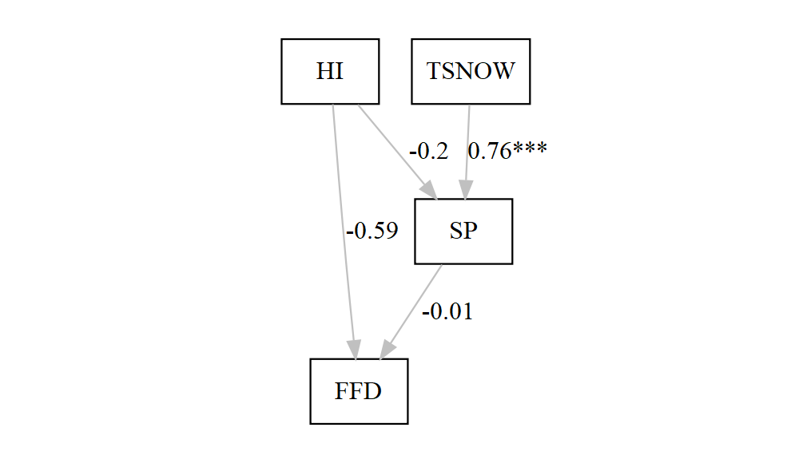
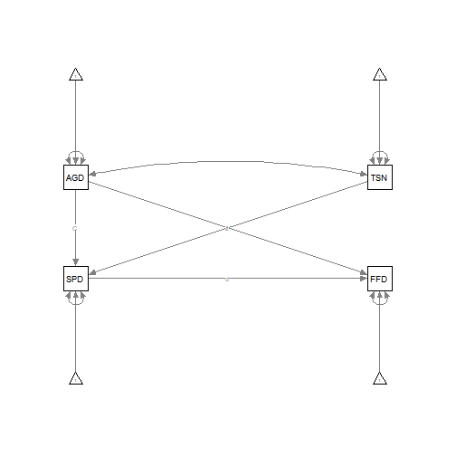
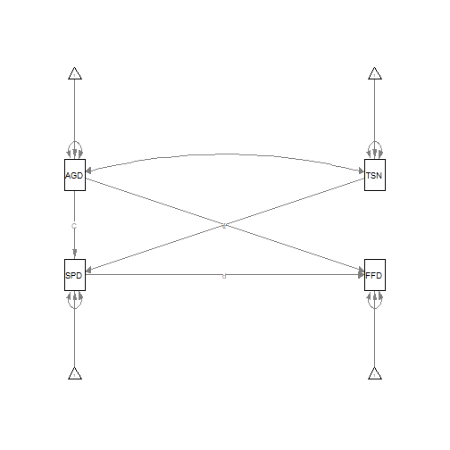

# Path analysis for phenology project


```r
remove(list = ls())
```

Load Libraries


```r
library(lavaan)
library(sem)
library(lavaanPlot)
library(modelsummary)
```

Load Data


```r
anemo.paten <- read.csv( file = "Data/anemo.paten.csv", 
                header = T, stringsAsFactors = F)
str(anemo.paten)
```

```
## 'data.frame':	29 obs. of  6 variables:
##  $ year : int  1942 1943 1944 1945 1946 1947 1948 1949 1950 1951 ...
##  $ SPDX : num  0 2 0 0 0 0 8 1 4 8 ...
##  $ DOBG : int  99 88 93 108 97 101 93 89 118 92 ...
##  $ AGDU : int  105 112 118 99 104 122 115 109 138 122 ...
##  $ FFD  : int  NA NA NA NA NA NA NA NA NA NA ...
##  $ TSNOW: num  7.3 22.4 21.2 13.6 17.7 10.9 30.2 20 27.6 29.3 ...
```

### Path analysis model specification


```r
model<-'
SPDX ~ 1+ C*AGDU + c*TSNOW
FFD ~ 1+  d*SPDX + f*AGDU
#estimtating the variances of the exogenous variables 
TSNOW ~~ TSNOW
AGDU ~~ AGDU
#estimtating the covariances of the exogenous variables (ses, mastery,performance)
TSNOW ~~ AGDU
#estimating the residual variances for endogenous variables (interest, anxiety, achieve)
SPDX ~~ SPDX
FFD ~~ FFD
#Indirect effects of TSNOW on FFD
TSNOWie2:= 1+ c*d
#Indirect effects of AGDU on FFD
AGDUie2:= 1+ C*d
AGDUiet:= 1 + AGDUie2 + f
#Indirect effect of SPDX on FFD
TSNOW ~ 1
AGDU ~ 1'
```

### Lavaan function


```r
fit<-lavaan(model,data=anemo.paten, missing = "fiml")
summary(fit,fit.measures=TRUE)
```

```
## Length  Class   Mode 
##      1 lavaan     S4
```

```r
modelsummary(fit)
```

<table class="table" style="width: auto !important; margin-left: auto; margin-right: auto;">
 <thead>
  <tr>
   <th style="text-align:left;">   </th>
   <th style="text-align:left;"> Model 1 </th>
  </tr>
 </thead>
<tbody>
  <tr>
   <td style="text-align:left;"> AGDU ~~ AGDU </td>
   <td style="text-align:left;"> 139.826 </td>
  </tr>
  <tr>
   <td style="text-align:left;">  </td>
   <td style="text-align:left;"> (36.720) </td>
  </tr>
  <tr>
   <td style="text-align:left;"> AGDU ~~ TSNOW </td>
   <td style="text-align:left;"> 38.371 </td>
  </tr>
  <tr>
   <td style="text-align:left;">  </td>
   <td style="text-align:left;"> (22.125) </td>
  </tr>
  <tr>
   <td style="text-align:left;"> AGDU ~1 </td>
   <td style="text-align:left;"> 113.034 </td>
  </tr>
  <tr>
   <td style="text-align:left;">  </td>
   <td style="text-align:left;"> (2.196) </td>
  </tr>
  <tr>
   <td style="text-align:left;"> AGDUie2  × = 1+C*d </td>
   <td style="text-align:left;"> 0.921 </td>
  </tr>
  <tr>
   <td style="text-align:left;">  </td>
   <td style="text-align:left;"> (0.101) </td>
  </tr>
  <tr>
   <td style="text-align:left;"> AGDUiet  × = 1+AGDUie2+f </td>
   <td style="text-align:left;"> 3.370 </td>
  </tr>
  <tr>
   <td style="text-align:left;">  </td>
   <td style="text-align:left;"> (0.506) </td>
  </tr>
  <tr>
   <td style="text-align:left;"> FFD ~ AGDU </td>
   <td style="text-align:left;"> 1.449 </td>
  </tr>
  <tr>
   <td style="text-align:left;">  </td>
   <td style="text-align:left;"> (0.561) </td>
  </tr>
  <tr>
   <td style="text-align:left;"> FFD ~ SPDX </td>
   <td style="text-align:left;"> -1.117 </td>
  </tr>
  <tr>
   <td style="text-align:left;">  </td>
   <td style="text-align:left;"> (1.274) </td>
  </tr>
  <tr>
   <td style="text-align:left;"> FFD ~~ FFD </td>
   <td style="text-align:left;"> 267.675 </td>
  </tr>
  <tr>
   <td style="text-align:left;">  </td>
   <td style="text-align:left;"> (154.542) </td>
  </tr>
  <tr>
   <td style="text-align:left;"> FFD ~1 </td>
   <td style="text-align:left;"> -41.600 </td>
  </tr>
  <tr>
   <td style="text-align:left;">  </td>
   <td style="text-align:left;"> (57.949) </td>
  </tr>
  <tr>
   <td style="text-align:left;"> SPDX ~ AGDU </td>
   <td style="text-align:left;"> 0.070 </td>
  </tr>
  <tr>
   <td style="text-align:left;">  </td>
   <td style="text-align:left;"> (0.042) </td>
  </tr>
  <tr>
   <td style="text-align:left;"> SPDX ~ TSNOW </td>
   <td style="text-align:left;"> 0.335 </td>
  </tr>
  <tr>
   <td style="text-align:left;">  </td>
   <td style="text-align:left;"> (0.052) </td>
  </tr>
  <tr>
   <td style="text-align:left;"> SPDX ~~ SPDX </td>
   <td style="text-align:left;"> 6.289 </td>
  </tr>
  <tr>
   <td style="text-align:left;">  </td>
   <td style="text-align:left;"> (1.652) </td>
  </tr>
  <tr>
   <td style="text-align:left;"> SPDX ~1 </td>
   <td style="text-align:left;"> -11.573 </td>
  </tr>
  <tr>
   <td style="text-align:left;">  </td>
   <td style="text-align:left;"> (4.522) </td>
  </tr>
  <tr>
   <td style="text-align:left;"> TSNOW ~~ TSNOW </td>
   <td style="text-align:left;"> 90.996 </td>
  </tr>
  <tr>
   <td style="text-align:left;">  </td>
   <td style="text-align:left;"> (23.897) </td>
  </tr>
  <tr>
   <td style="text-align:left;"> TSNOW ~1 </td>
   <td style="text-align:left;"> 18.541 </td>
  </tr>
  <tr>
   <td style="text-align:left;">  </td>
   <td style="text-align:left;"> (1.771) </td>
  </tr>
  <tr>
   <td style="text-align:left;"> TSNOWie2  × = 1+c*d </td>
   <td style="text-align:left;"> 0.626 </td>
  </tr>
  <tr>
   <td style="text-align:left;">  </td>
   <td style="text-align:left;"> (0.431) </td>
  </tr>
  <tr>
   <td style="text-align:left;"> Num.Obs. </td>
   <td style="text-align:left;"> 29 </td>
  </tr>
  <tr>
   <td style="text-align:left;"> AIC </td>
   <td style="text-align:left;"> 647.3 </td>
  </tr>
  <tr>
   <td style="text-align:left;"> BIC </td>
   <td style="text-align:left;"> 665.1 </td>
  </tr>
  <tr>
   <td style="text-align:left;"> agfi </td>
   <td style="text-align:left;"> 0.904 </td>
  </tr>
  <tr>
   <td style="text-align:left;"> cfi </td>
   <td style="text-align:left;"> 0.850 </td>
  </tr>
  <tr>
   <td style="text-align:left;"> chisq </td>
   <td style="text-align:left;"> 7.328 </td>
  </tr>
  <tr>
   <td style="text-align:left;"> converged </td>
   <td style="text-align:left;"> TRUE </td>
  </tr>
  <tr>
   <td style="text-align:left;"> estimator </td>
   <td style="text-align:left;"> ML </td>
  </tr>
  <tr>
   <td style="text-align:left;"> missing_method </td>
   <td style="text-align:left;"> ml </td>
  </tr>
  <tr>
   <td style="text-align:left;"> nexcluded </td>
   <td style="text-align:left;"> 0 </td>
  </tr>
  <tr>
   <td style="text-align:left;"> ngroups </td>
   <td style="text-align:left;"> 1 </td>
  </tr>
  <tr>
   <td style="text-align:left;"> norig </td>
   <td style="text-align:left;"> 29 </td>
  </tr>
  <tr>
   <td style="text-align:left;"> npar </td>
   <td style="text-align:left;"> 13.000 </td>
  </tr>
  <tr>
   <td style="text-align:left;"> rmsea </td>
   <td style="text-align:left;"> 0.467 </td>
  </tr>
  <tr>
   <td style="text-align:left;"> rmsea.conf.high </td>
   <td style="text-align:left;"> 0.808 </td>
  </tr>
  <tr>
   <td style="text-align:left;"> srmr </td>
   <td style="text-align:left;"> 0.258 </td>
  </tr>
  <tr>
   <td style="text-align:left;"> tli </td>
   <td style="text-align:left;"> 0.098 </td>
  </tr>
</tbody>
</table>

### Standardized Measurements


```r
summary(fit,fit.measures=TRUE,standardized=TRUE,rsquare=TRUE)
```

```
## Length  Class   Mode 
##      1 lavaan     S4
```

### Confidence Intervals


```r
parameterEstimates(fit)
```

```
##         lhs op         rhs    label     est      se      z pvalue ci.lower ci.upper
## 1      SPDX ~1                      -11.573   4.522 -2.559  0.010  -20.437   -2.709
## 2      SPDX  ~        AGDU        C   0.070   0.042  1.679  0.093   -0.012    0.152
## 3      SPDX  ~       TSNOW        c   0.335   0.052  6.457  0.000    0.233    0.437
## 4       FFD ~1                      -41.600  57.949 -0.718  0.473 -155.177   71.978
## 5       FFD  ~        SPDX        d  -1.117   1.274 -0.877  0.381   -3.615    1.380
## 6       FFD  ~        AGDU        f   1.449   0.561  2.584  0.010    0.350    2.548
## 7     TSNOW ~~       TSNOW           90.996  23.897  3.808  0.000   44.159  137.832
## 8      AGDU ~~        AGDU          139.826  36.720  3.808  0.000   67.856  211.797
## 9      AGDU ~~       TSNOW           38.371  22.125  1.734  0.083   -4.993   81.735
## 10     SPDX ~~        SPDX            6.289   1.652  3.808  0.000    3.052    9.526
## 11      FFD ~~         FFD          267.675 154.542  1.732  0.083  -35.222  570.573
## 12    TSNOW ~1                       18.541   1.771 10.467  0.000   15.070   22.013
## 13     AGDU ~1                      113.034   2.196 51.477  0.000  108.731  117.338
## 14 TSNOWie2 :=       1+c*d TSNOWie2   0.626   0.431  1.451  0.147   -0.219    1.470
## 15  AGDUie2 :=       1+C*d  AGDUie2   0.921   0.101  9.116  0.000    0.723    1.120
## 16  AGDUiet := 1+AGDUie2+f  AGDUiet   3.370   0.506  6.654  0.000    2.377    4.363
```

### Comprehensive set of fit measures


```r
fitMeasures(fit)
```

```
##                npar                fmin               chisq                  df              pvalue      baseline.chisq 
##              13.000               0.126               7.328               1.000               0.007              48.099 
##         baseline.df     baseline.pvalue                 cfi                 tli                nnfi                 rfi 
##               6.000               0.000               0.850               0.098               0.098               0.086 
##                 nfi                pnfi                 ifi                 rni                logl   unrestricted.logl 
##               0.848               0.141               0.866               0.850            -310.652            -306.988 
##                 aic                 bic              ntotal                bic2               rmsea      rmsea.ci.lower 
##             647.305             665.080              29.000             624.632               0.467               0.197 
##      rmsea.ci.upper        rmsea.pvalue                 rmr          rmr_nomean                srmr        srmr_bentler 
##               0.808               0.009              75.710              89.570               0.258               0.258 
## srmr_bentler_nomean                crmr         crmr_nomean          srmr_mplus   srmr_mplus_nomean               cn_05 
##               0.299               0.397               0.401               0.340               0.318              16.202 
##               cn_01                 gfi                agfi                pgfi                 mfi                ecvi 
##              27.256               0.993               0.904               0.071               0.897               1.149
```

### Modification indicies


```r
modificationIndices(fit)
```

```
##      lhs op   rhs    mi      epc  sepc.lv sepc.all sepc.nox
## 17  SPDX ~~   FFD 1.401   25.812   25.812    0.629    0.629
## 20   FFD ~~  AGDU 1.401  403.406  403.406    2.085    2.085
## 21   FFD ~~ TSNOW 1.401 -110.703 -110.703   -0.709   -0.709
## 22  SPDX  ~   FFD 1.401    0.096    0.096    0.500    0.500
## 23   FFD  ~ TSNOW 1.401   -1.376   -1.376   -0.580   -0.580
## 25  AGDU  ~   FFD 1.401    1.507    1.507    2.882    2.882
## 28 TSNOW  ~   FFD 1.401   -0.414   -0.414   -0.981   -0.981
```

### Example path plots


```r
lavaanPlot(model = fit, node_options = list(shape = "box", fontname = 
                                              "Helvetica"), edge_options = list(color = "grey"), 
           coefs = TRUE,covs=
             TRUE,stars = c("regress"))
```



```r
library(semPlot)
semPaths(fit)
```



```r
ezknitr::ezspin(file = "Program/path_noDOBG/SEM_anemopaten_test1.R", out_dir = "Output", keep_rmd = F, keep_md = F)
```

```
## ezspin output in
## C:\Users\moin2\OneDrive\Documents\Bareground\Output
```

```r
#https://nmmichalak.github.io/nicholas_michalak/blog_entries/2018/nrg01/nrg01.html 
```



