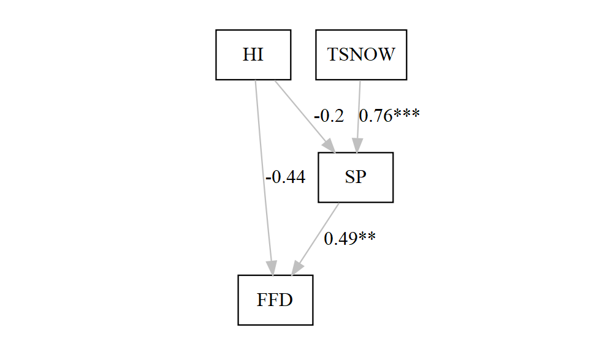
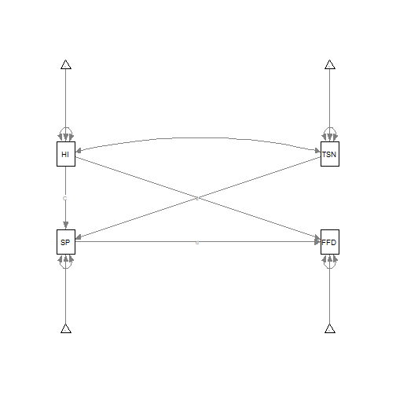
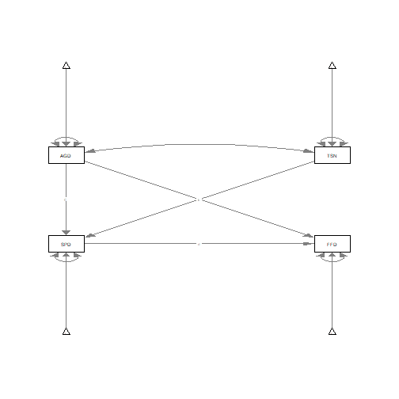

# Path analysis for phenology project


```r
remove(list = ls())
```

Load Libraries


```r
library(lavaan)
library(sem)
library(lavaanPlot)
library(modelsummary)
```

Load Data


```r
rosa.arkan <- read.csv( file = "Data/rosa.arkan.csv", 
                header = T, stringsAsFactors = F)
str(rosa.arkan)
```

```
## 'data.frame':	29 obs. of  7 variables:
##  $ year : int  1942 1943 1944 1945 1946 1947 1948 1949 1950 1951 ...
##  $ SPDX : num  0 10 1 0 0 0 13 2 5 10 ...
##  $ DOBG : int  99 88 93 108 97 101 93 89 118 92 ...
##  $ AGDU : int  105 112 118 99 104 122 115 109 138 122 ...
##  $ FFD  : int  NA NA NA NA NA NA NA NA NA NA ...
##  $ X    : logi  NA NA NA NA NA NA ...
##  $ TSNOW: num  7.3 22.4 21.2 13.6 17.7 10.9 30.2 20 27.6 29.3 ...
```

### Path analysis model specification


```r
model<-'
SPDX ~ 1+ C*AGDU + c*TSNOW
FFD ~ 1+  d*SPDX + f*AGDU
#estimtating the variances of the exogenous variables 
TSNOW ~~ TSNOW
AGDU ~~ AGDU
#estimtating the covariances of the exogenous variables (ses, mastery,performance)
TSNOW ~~ AGDU
#estimating the residual variances for endogenous variables (interest, anxiety, achieve)
SPDX ~~ SPDX
FFD ~~ FFD
#Indirect effects of TSNOW on FFD
TSNOWie2:= 1+ c*d
#Indirect effects of AGDU on FFD
AGDUie2:= 1+ C*d
AGDUiet:= 1 + AGDUie2 + f
#Indirect effect of SPDX on FFD
TSNOW ~ 1
AGDU ~ 1'
```

### Lavaan function


```r
fit<-lavaan(model,data=rosa.arkan, missing = "fiml")
summary(fit,fit.measures=TRUE)
```

```
## Length  Class   Mode 
##      1 lavaan     S4
```

```r
modelsummary(fit)
```

<table class="table" style="width: auto !important; margin-left: auto; margin-right: auto;">
 <thead>
  <tr>
   <th style="text-align:left;">   </th>
   <th style="text-align:left;"> Model 1 </th>
  </tr>
 </thead>
<tbody>
  <tr>
   <td style="text-align:left;"> AGDU ~~ AGDU </td>
   <td style="text-align:left;"> 139.826 </td>
  </tr>
  <tr>
   <td style="text-align:left;">  </td>
   <td style="text-align:left;"> (36.720) </td>
  </tr>
  <tr>
   <td style="text-align:left;"> AGDU ~~ TSNOW </td>
   <td style="text-align:left;"> 38.371 </td>
  </tr>
  <tr>
   <td style="text-align:left;">  </td>
   <td style="text-align:left;"> (22.125) </td>
  </tr>
  <tr>
   <td style="text-align:left;"> AGDU ~1 </td>
   <td style="text-align:left;"> 113.034 </td>
  </tr>
  <tr>
   <td style="text-align:left;">  </td>
   <td style="text-align:left;"> (2.196) </td>
  </tr>
  <tr>
   <td style="text-align:left;"> AGDUie2  × = 1+C*d </td>
   <td style="text-align:left;"> 1.052 </td>
  </tr>
  <tr>
   <td style="text-align:left;">  </td>
   <td style="text-align:left;"> (0.039) </td>
  </tr>
  <tr>
   <td style="text-align:left;"> AGDUiet  × = 1+AGDUie2+f </td>
   <td style="text-align:left;"> 2.416 </td>
  </tr>
  <tr>
   <td style="text-align:left;">  </td>
   <td style="text-align:left;"> (0.107) </td>
  </tr>
  <tr>
   <td style="text-align:left;"> FFD ~ AGDU </td>
   <td style="text-align:left;"> 0.364 </td>
  </tr>
  <tr>
   <td style="text-align:left;">  </td>
   <td style="text-align:left;"> (0.106) </td>
  </tr>
  <tr>
   <td style="text-align:left;"> FFD ~ SPDX </td>
   <td style="text-align:left;"> 0.700 </td>
  </tr>
  <tr>
   <td style="text-align:left;">  </td>
   <td style="text-align:left;"> (0.241) </td>
  </tr>
  <tr>
   <td style="text-align:left;"> FFD ~~ FFD </td>
   <td style="text-align:left;"> 11.512 </td>
  </tr>
  <tr>
   <td style="text-align:left;">  </td>
   <td style="text-align:left;"> (6.153) </td>
  </tr>
  <tr>
   <td style="text-align:left;"> FFD ~1 </td>
   <td style="text-align:left;"> 123.714 </td>
  </tr>
  <tr>
   <td style="text-align:left;">  </td>
   <td style="text-align:left;"> (11.410) </td>
  </tr>
  <tr>
   <td style="text-align:left;"> SPDX ~ AGDU </td>
   <td style="text-align:left;"> 0.074 </td>
  </tr>
  <tr>
   <td style="text-align:left;">  </td>
   <td style="text-align:left;"> (0.049) </td>
  </tr>
  <tr>
   <td style="text-align:left;"> SPDX ~ TSNOW </td>
   <td style="text-align:left;"> 0.398 </td>
  </tr>
  <tr>
   <td style="text-align:left;">  </td>
   <td style="text-align:left;"> (0.061) </td>
  </tr>
  <tr>
   <td style="text-align:left;"> SPDX ~~ SPDX </td>
   <td style="text-align:left;"> 8.556 </td>
  </tr>
  <tr>
   <td style="text-align:left;">  </td>
   <td style="text-align:left;"> (2.247) </td>
  </tr>
  <tr>
   <td style="text-align:left;"> SPDX ~1 </td>
   <td style="text-align:left;"> -12.372 </td>
  </tr>
  <tr>
   <td style="text-align:left;">  </td>
   <td style="text-align:left;"> (5.275) </td>
  </tr>
  <tr>
   <td style="text-align:left;"> TSNOW ~~ TSNOW </td>
   <td style="text-align:left;"> 90.996 </td>
  </tr>
  <tr>
   <td style="text-align:left;">  </td>
   <td style="text-align:left;"> (23.897) </td>
  </tr>
  <tr>
   <td style="text-align:left;"> TSNOW ~1 </td>
   <td style="text-align:left;"> 18.541 </td>
  </tr>
  <tr>
   <td style="text-align:left;">  </td>
   <td style="text-align:left;"> (1.771) </td>
  </tr>
  <tr>
   <td style="text-align:left;"> TSNOWie2  × = 1+c*d </td>
   <td style="text-align:left;"> 1.279 </td>
  </tr>
  <tr>
   <td style="text-align:left;">  </td>
   <td style="text-align:left;"> (0.105) </td>
  </tr>
  <tr>
   <td style="text-align:left;"> Num.Obs. </td>
   <td style="text-align:left;"> 29 </td>
  </tr>
  <tr>
   <td style="text-align:left;"> AIC </td>
   <td style="text-align:left;"> 642.6 </td>
  </tr>
  <tr>
   <td style="text-align:left;"> BIC </td>
   <td style="text-align:left;"> 660.4 </td>
  </tr>
  <tr>
   <td style="text-align:left;"> agfi </td>
   <td style="text-align:left;"> 0.965 </td>
  </tr>
  <tr>
   <td style="text-align:left;"> cfi </td>
   <td style="text-align:left;"> 0.943 </td>
  </tr>
  <tr>
   <td style="text-align:left;"> chisq </td>
   <td style="text-align:left;"> 3.570 </td>
  </tr>
  <tr>
   <td style="text-align:left;"> converged </td>
   <td style="text-align:left;"> TRUE </td>
  </tr>
  <tr>
   <td style="text-align:left;"> estimator </td>
   <td style="text-align:left;"> ML </td>
  </tr>
  <tr>
   <td style="text-align:left;"> missing_method </td>
   <td style="text-align:left;"> ml </td>
  </tr>
  <tr>
   <td style="text-align:left;"> nexcluded </td>
   <td style="text-align:left;"> 0 </td>
  </tr>
  <tr>
   <td style="text-align:left;"> ngroups </td>
   <td style="text-align:left;"> 1 </td>
  </tr>
  <tr>
   <td style="text-align:left;"> norig </td>
   <td style="text-align:left;"> 29 </td>
  </tr>
  <tr>
   <td style="text-align:left;"> npar </td>
   <td style="text-align:left;"> 13.000 </td>
  </tr>
  <tr>
   <td style="text-align:left;"> rmsea </td>
   <td style="text-align:left;"> 0.298 </td>
  </tr>
  <tr>
   <td style="text-align:left;"> rmsea.conf.high </td>
   <td style="text-align:left;"> 0.656 </td>
  </tr>
  <tr>
   <td style="text-align:left;"> srmr </td>
   <td style="text-align:left;"> 0.225 </td>
  </tr>
  <tr>
   <td style="text-align:left;"> tli </td>
   <td style="text-align:left;"> 0.661 </td>
  </tr>
</tbody>
</table>

### Standardized Measurements


```r
summary(fit,fit.measures=TRUE,standardized=TRUE,rsquare=TRUE)
```

```
## Length  Class   Mode 
##      1 lavaan     S4
```

### Confidence Intervals


```r
parameterEstimates(fit)
```

```
##         lhs op         rhs    label     est     se      z pvalue ci.lower ci.upper
## 1      SPDX ~1                      -12.372  5.275 -2.346  0.019  -22.711   -2.034
## 2      SPDX  ~        AGDU        C   0.074  0.049  1.516  0.130   -0.022    0.170
## 3      SPDX  ~       TSNOW        c   0.398  0.061  6.577  0.000    0.280    0.517
## 4       FFD ~1                      123.714 11.410 10.843  0.000  101.351  146.076
## 5       FFD  ~        SPDX        d   0.700  0.241  2.902  0.004    0.227    1.173
## 6       FFD  ~        AGDU        f   0.364  0.106  3.420  0.001    0.155    0.572
## 7     TSNOW ~~       TSNOW           90.996 23.897  3.808  0.000   44.159  137.832
## 8      AGDU ~~        AGDU          139.826 36.720  3.808  0.000   67.856  211.797
## 9      AGDU ~~       TSNOW           38.371 22.125  1.734  0.083   -4.993   81.735
## 10     SPDX ~~        SPDX            8.556  2.247  3.808  0.000    4.152   12.959
## 11      FFD ~~         FFD           11.512  6.153  1.871  0.061   -0.548   23.572
## 12    TSNOW ~1                       18.541  1.771 10.467  0.000   15.070   22.013
## 13     AGDU ~1                      113.034  2.196 51.477  0.000  108.731  117.338
## 14 TSNOWie2 :=       1+c*d TSNOWie2   1.279  0.105 12.173  0.000    1.073    1.485
## 15  AGDUie2 :=       1+C*d  AGDUie2   1.052  0.039 27.252  0.000    0.976    1.127
## 16  AGDUiet := 1+AGDUie2+f  AGDUiet   2.416  0.107 22.665  0.000    2.207    2.624
```

### Comprehensive set of fit measures


```r
fitMeasures(fit)
```

```
##                npar                fmin               chisq                  df              pvalue      baseline.chisq 
##              13.000               0.062               3.570               1.000               0.059              51.472 
##         baseline.df     baseline.pvalue                 cfi                 tli                nnfi                 rfi 
##               6.000               0.000               0.943               0.661               0.661               0.584 
##                 nfi                pnfi                 ifi                 rni                logl   unrestricted.logl 
##               0.931               0.155               0.949               0.943            -308.317            -306.532 
##                 aic                 bic              ntotal                bic2               rmsea      rmsea.ci.lower 
##             642.634             660.409              29.000             619.961               0.298               0.000 
##      rmsea.ci.upper        rmsea.pvalue                 rmr          rmr_nomean                srmr        srmr_bentler 
##               0.656               0.068              17.811              21.052               0.225               0.225 
## srmr_bentler_nomean                crmr         crmr_nomean          srmr_mplus   srmr_mplus_nomean               cn_05 
##               0.238               0.728               0.334               0.617               0.263              32.201 
##               cn_01                 gfi                agfi                pgfi                 mfi                ecvi 
##              54.891               0.997               0.965               0.071               0.957               1.020
```

### Modification indicies


```r
modificationIndices(fit)
```

```
##      lhs op   rhs    mi     epc sepc.lv sepc.all sepc.nox
## 17  SPDX ~~   FFD 0.404   3.081   3.081    0.310    0.310
## 20   FFD ~~  AGDU 0.404  42.049  42.049    1.048    1.048
## 21   FFD ~~ TSNOW 0.404 -11.539 -11.539   -0.357   -0.357
## 22  SPDX  ~   FFD 0.404   0.268   0.268    0.392    0.392
## 23   FFD  ~ TSNOW 0.404  -0.143  -0.143   -0.183   -0.183
## 25  AGDU  ~   FFD 0.404   3.652   3.652    2.308    2.308
## 28 TSNOW  ~   FFD 0.404  -1.002  -1.002   -0.785   -0.785
```

### Example path plots


```r
lavaanPlot(model = fit, node_options = list(shape = "box", fontname = 
                                              "serif"), edge_options = list(color = "grey"), 
           coefs = TRUE,covs=
             TRUE,stars = c("regress"))
```



```r
library(semPlot)
semPaths(fit)
```



```r
ezknitr::ezspin(file = "Program/path_noDOBG/SEM_rosaarkan_test1.R", out_dir = "Output", keep_rmd = F, keep_md = F)
```

```
## ezspin output in
## C:\Users\moin2\OneDrive\Documents\Bareground\Output
```

```r
#https://nmmichalak.github.io/nicholas_michalak/blog_entries/2018/nrg01/nrg01.html 
```



